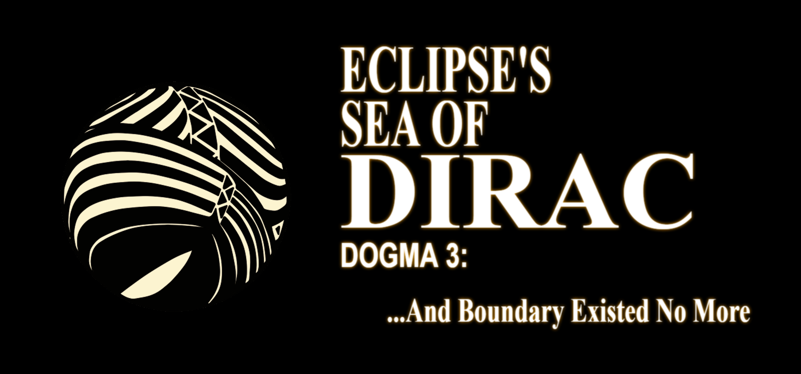

  

  <strong>A Free, Open Source Solution For Secure Application To Application Communication</strong>

Eclipse creates a simple, high speed system for allowing applications to speak to each other. It was made around supporting different applications, APIs and even local LLMs. It does so in a way where injecting false requests or reading the results of a request is almost impossible to outside programs. Atop this, it uses NIST recommended PQC algorithms such as AES-256-GCM and KYBER-Crystals.

<strong>Cross Platform • Fully Offline • Post Quantum Computing Resistant • No BS</strong>

  <a href="https://walker-industries-rnd.github.io/Eclipse/welcome.html">Read Documentation Here</a>

---

## Core Features

- Expose any static method with one attribute → instantly callable over secure channel  
- Strong mutual authentication & encryption using pre-shared keys + ephemeral Kyber-based key exchange  
- AES-256-GCM for request/response payloads  
- Hard for third-party processes to inject or read traffic  
- Designed for local-first scenarios (desktop apps ↔ local LLMs ↔ tools ↔ services)  
- No central server required beyond the machine itself  

---
## Requirements

The following (Free, Open Source Solutions on our Github) libraries are required for this to workl

[- Pariah Cybersecurity ](https://github.com/Walker-Industries-RnD/PariahCybersecurity)
[- Secure Store ](https://github.com/Walker-Industries-RnD/Secure-Store/tree/main)

Also, be sure your project references both Eclipse and EclipseLCL!

Finally, check these out!

[XRUIOS.Barebones; the project this was made for and](https://github.com/Walker-Industries-RnD/XRUIOS.Barebones)

[XRUIOS.Dirac; the implementation of this on a real setting!](https://github.com/Walker-Industries-RnD/XRUIOS.Dirac/tree/main)

---

## Meet the Team

|  |  |  |
|:---:|:---:|:---:|
| **Jpena173** Backend Support / Development Help [GitHub](https://github.com/jpena173)  "You are your strongest advocate, capable of more than you'd think." | **WalkerDev** Founder / Lead Developer  “Don't be afraid of change—Think of it as something that'll open the door to deeper, more precious feelings for you in the future.” [YouTube](https://www.youtube.com/@walkerdev1) | **Chubu** QA & VN Artist  "If you don't know how to do something, keep doing it! You'll figure it out eventually! :3" |

---

## How It Works (High-Level)

1. Server-side: mark methods with `[SeaOfDirac(...)]` → they become discoverable & callable  
2. Server runs with one line: `EclipseServer.RunServer("MyServerName")`  
3. Client discovers server address (via SecureStore or other mechanism)  
4. Client performs secure enrollment + handshake (PSK + Kyber + nonces + transcript)  
5. Client sends encrypted `DiracRequest` → server executes → encrypted `DiracResponse` returned  
6. End-to-end confidentiality, integrity, and freshness via AEAD + transcript proofs  

---

## Security Summary

- **Enrollment** → registers client ID + PSK  
- **Handshake** → Kyber-encrypted key exchange → shared secret  
- **Session** → AES-256-GCM + per-message nonces  
- **Transcript** → HMAC-protected log of handshake messages → prevents downgrade & MITM  
- Designed to resist classical & quantum adversaries (where Kyber helps)

---

## License & Artwork

**Code**  
[NON-AI MPL 2.0](https://raw.githubusercontent.com/non-ai-licenses/non-ai-licenses/main/NON-AI-MPL-2.0)

This software is licensed under MPL 2.0 **with the following exception**:

**Artwork**  
© Chubu — **NO AI training. NO reproduction. NO exceptions.**

> Unauthorized use of the artwork — including copying, distribution, modification, or inclusion in any machine-learning training dataset — is strictly prohibited and will be prosecuted to the fullest extent of the law.
